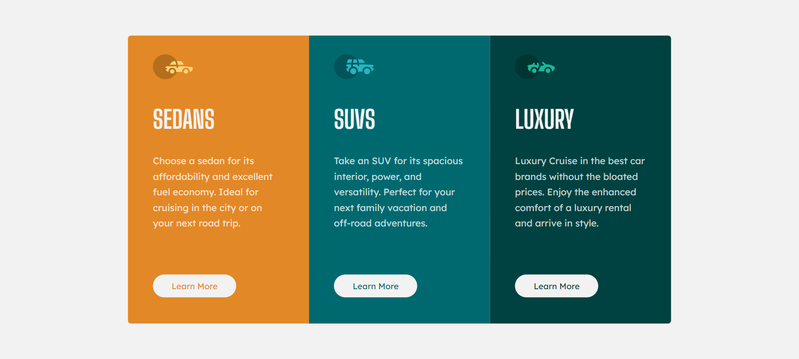

# Frontend Mentor - 3-column preview card component solution

This is a solution to the [3-column preview card component challenge on Frontend Mentor](https://www.frontendmentor.io/challenges/3column-preview-card-component-pH92eAR2-). Frontend Mentor challenges help you improve your coding skills by building realistic projects.

## Table of contents

- [Overview](#overview)
  - [The challenge](#the-challenge)
  - [Screenshot](#screenshot)
  - [Links](#links)
- [My process](#my-process)
  - [Built with](#built-with)
  - [What I learned](#what-i-learned)
  - [Continued development](#continued-development)
- [Author](#author)

## Overview

### The challenge

Users should be able to:

- View the optimal layout depending on their device's screen size
- See hover states for interactive elements

### Screenshot



### Links

- Solution URL: https://www.frontendmentor.io/solutions/3-column-preview-card-using-css-flexbox-EWrthkiw1O
- Live Site URL: https://3columnpreview.vercel.app/

## My process

### Built with

- Flexbox

### What I learned

Learnt how to make the website change based on device using media queries (first time using media queries)

```css
@media screen and (max-width: 900px) {
  .container {
    display: flex;
    flex-direction: column;
    height: 80%;
    padding-bottom: 900px;
    padding-top: 900px;
  }

  .card1 {
    border-top-left-radius: 5px;
    border-bottom-left-radius: 0;
    border-top-right-radius: 5px;
  }

  .card3 {
    border-bottom-left-radius: 5px;
    border-bottom-right-radius: 5px;
    border-top-right-radius: 0;
  }
}
```

### Continued development

Would like to understand and utilise media queries more to make responsive layouts. Still don't fully understand positioning yet and would like to improve in that aspect.

## Author

- Frontend Mentor - [@daebraek](https://www.frontendmentor.io/profile/daebraek)
- Twitter - [@daebraek_uptm](https://www.instagram.com/daebraek_uptm/?hl=en)
